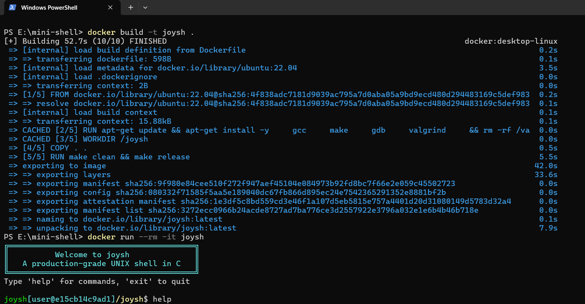
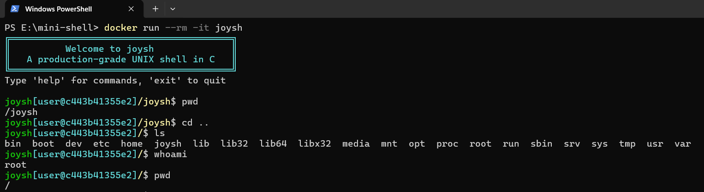
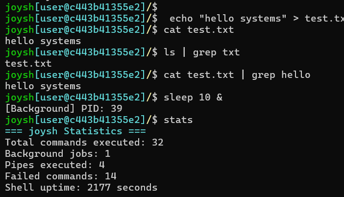
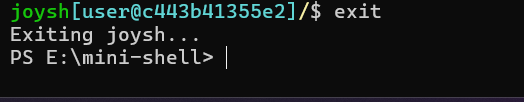

```bash
$ ./joysh

     _                 _     
    (_) ___  _   _ ___| |__  
    | |/ _ \| | | / __| '_ \ 
    | | (_) | |_| \__ \ | | |
   _/ |\___/ \__, |___/_| |_|
  |__/        |___/          

```

Production-grade UNIX shell written in C with support for process execution, pipelines, redirection, background jobs and signal handling.

Built to demonstrate Linux systems programming concepts including process lifecycle management, inter-process communication, file descriptor manipulation and UNIX shell architecture.

---

## Features

* Interactive shell runtime
* Command parsing and tokenization
* External command execution via `fork()` + `execvp()`
* Built-in commands:

  * `cd`
  * `pwd`
  * `exit`
  * `history`
  * `clear`
  * `stats`
* Multi-stage pipelines
* Input/output redirection
* Background process execution
* Signal handling (`SIGINT`, `SIGTSTP`)
* Command logging and execution metrics
* Dockerized runtime environment
* Modular subsystem architecture

---

## Architecture

```text
src/
├── main.c          Shell loop and orchestration
├── tokenizer.c     Input tokenization
├── parser.c        Command parsing
├── executor.c      Process execution and pipelines
├── builtins.c      Built-in shell commands
├── redirect.c      File descriptor redirection
├── signals.c       Signal handling
└── logger.c        Logging and metrics
```

---

## System Calls Used

| System Call   | Purpose                     |
| ------------- | --------------------------- |
| `fork()`      | Process creation            |
| `execvp()`    | Program execution           |
| `waitpid()`   | Process synchronization     |
| `pipe()`      | Inter-process communication |
| `dup2()`      | File descriptor duplication |
| `open()`      | File operations             |
| `close()`     | File descriptor cleanup     |
| `sigaction()` | Signal handling             |
| `chdir()`     | Directory management        |
| `getcwd()`    | Current working directory   |

---

## Build

### Native Linux / WSL

```bash
make
./bin/joysh
```

---

## Docker

```bash
docker build -t joysh .
docker run --rm -it joysh
```

---

## Runtime

### Docker Build



### Interactive Shell



### Pipes, Background Jobs and Metrics



### Error Handling and Exit


---

## Example Usage

```bash
joysh$ pwd

joysh$ ls | grep txt

joysh$ echo "hello" > output.txt

joysh$ sleep 10 &

joysh$ stats

joysh$ exit
```

---

## Testing

```bash
chmod +x tests/test.sh
./tests/test.sh
```

Memory leak checks:

```bash
make valgrind
```

---

## Build Targets

```bash
make
make clean
make debug
make release
make valgrind
```

---

## Design Goals

* POSIX-oriented implementation
* Explicit process lifecycle handling
* Minimal runtime overhead
* File descriptor correctness
* Modular subsystem isolation
* Reproducible containerized runtime

---

## Current Limitations

* No job control (`fg`, `bg`, `jobs`)
* No readline integration
* No wildcard/globbing expansion
* No shell scripting support
* No environment variable expansion

---

## Repository Structure

```text
.
├── src/
├── include/
├── tests/
├── docs/
├── screenshots/
├── Dockerfile
├── Makefile
├── LICENSE
├── README.md
└── .gitignore
```

---

## License

Licensed under the GNU General Public License v3.0 (GPL-3.0).
See the LICENSE file for details.
